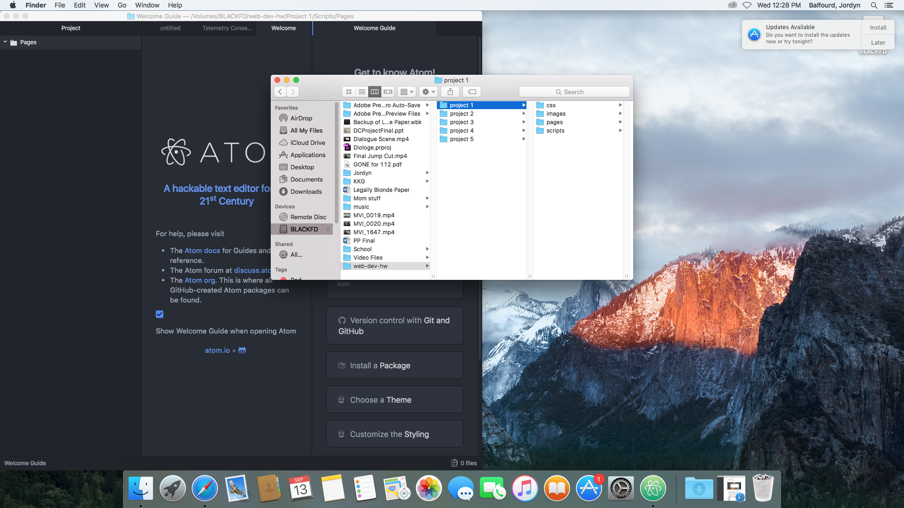

# My First README.md
## Jordyn Balfourd
**Was it a difficult process?** Yes, a pain in my butt. 

*I wanted to cry but pulled through*
1. I learned a lot during this process. It was hard to understand, with myself not being tech savey with Atom but finally with some help I finally got it up and running.
2. Another issue I faced was understanding how coding works and how everything you would normally do on a word document, whether it be making a section of text bold or inserting a picture. With the help of the cheat codes it laid my template out perfectly in a way I was able to understand.

- I look forward to learning more things and tricks to further my coding skills.

- I actually would like to use more coding websites to practice.

```markdown
# This is a code block.
## The work I did, did not take as long as I thought it would. But I did retain some coding information which is that it you want to **bold** something you simply  put 2 ** in front and behind a word to make it bold.
```

**Snopping** While completing snooping around I actually visited my mom's website. I looked at all the coding that went into the development of the website. It was pretty interesting. [permanentmakeup.org](http://www.permanentmakeup.org)
I also decided to check out Walmart's page and see how it has changed throughout time. Now a days there is a slideshow of different products where as before it just had pictures on the front page.

---
[youtube](https://www.youtube.com)


